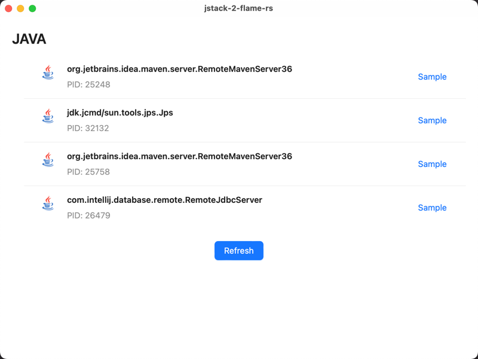
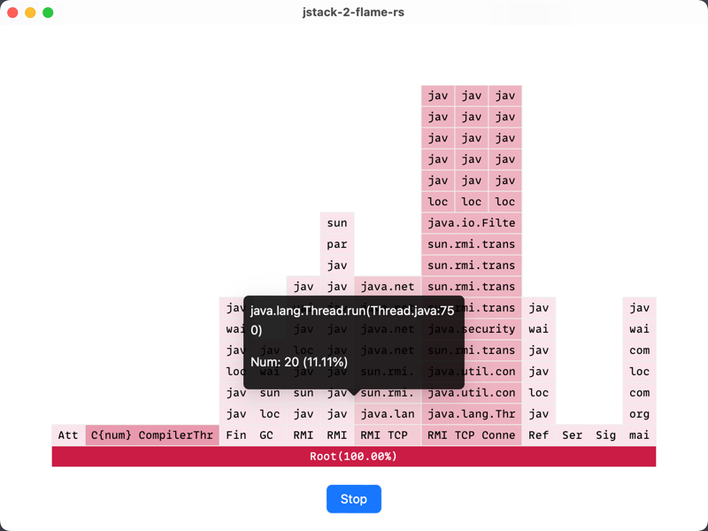

# jstack-2-flame-rs

## Introduction:

This project, aims to continuously sample the jstack information of a specified Java process (PID) and generate flame
graphs. Flame graphs are graphical representations of performance profiling data that highlight code hotspots.

## Project Functionality:

The main functionality of this project is to collect and analyze the stack traces (jstack information) of a Java process
and use the collected data to generate flame graphs. These flame graphs provide valuable insights into the performance
characteristics of the Java application, helping developers identify and optimize performance bottlenecks.

## Project Environment Requirements:

To successfully run this project, the following environment requirements must be met:

1. The system should have Java installed to run the necessary Java tools.
2. The project relies on the availability of the 'jps' (Java Virtual Machine Process Status Tool) and 'jstack' (Java
   Stack Trace) tools, which are typically bundled with the Java Development Kit (JDK) installation.
3. Rust Programming Language: The project contains Rust code, so you'll need to have a working Rust environment set up.
4. Package manager: yarn or npm

## Usage:

1. Clone the project repository and navigate to the project directory.
2. Run the following command to build the project:

```
yarn install
yarn tauri dev
```

## Example Images:

